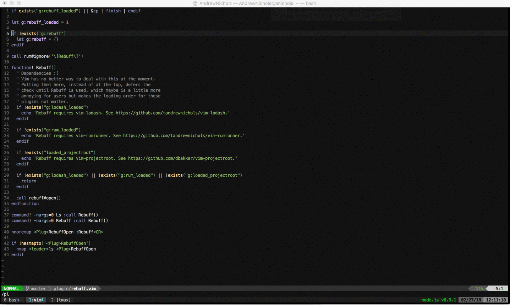

# Vim-Rebuff

A buffer explorer with file previewing.



## Overview

I used to use BufExplorer as my `:ls` wrapper but just looking at a list of buffer names, especially when they're very similar to one another, doesn't always make it easy to know which file you want, and the whole point of buffers in vim is to be able to get quickly to the one you need. What I wanted was something that would preview the buffer under the cursor to give the file some context. So I wrote that basic functionality (shout out to @jlanzarotta . . . I used BufExplorer as a reference to get started), and then it quickly became my pet project. Turns out I had a lot of ideas for "improving" on the typical buffer explorer. But that really depends what you like, so while I've chosen defaults based on what suits me, I think you'll find that most everything is easily customizable via options.

One major difference between this and other buffer explorers is that you can't (currently) open it in the current buffer or a new tab, primarily because the goal of this was to _preview_ files, and there's nowhere to show a preview in those cases. So I made the intentional decision, at least for now, to enforce opening Rebuff in splits. By default, Rebuff will open in a right vertical split 80 columns in width when you run `:Rebuff` or `:Ls`. The mapping `<leader>ls` is also provided, although you an override that. Once Rebuff is open, navigate using `j` and `k` (or `<Down>` and `<Up>`) and each buffer will be previewed on the other side of the screen. There are a lot of [helpful mappings](#mappings) specific to the Rebuff buffer as well.

## Requirements

This plugin uses timers, which means it requires at least vim 8.0.

## Installation

This plugin has three dependencies. I regret that slightly, since vim has no simple way to manage or install dependencies, but those dependencies are definitely stand-alone things that don't belong in this plugin, so you'll have to install them along with this plugin. Fortunately, this is pretty easy to do with a decent plugin manager. For what it's worth, I use `Plug` to manage my plugins, and I really like it, so if you don't have a plugin manager, I recommend that one.

#### Manually

If you're the type of person that doesn't use a plugin manager, prefering instead to do it manually, you probably already know the process here. This isn't on vim.org (atm), but you can get the source from here on github (either by cloning it or just copying the files in `plugin/`, `autoload/`, and `doc/` to the right places and then sourcing them in your .vimrc.

#### Plug (https://github.com/junegunn/vim-plug)
1. In your .vimrc or something sourced therein:
  ```
  Plug 'tandrewnichols/vim-vigor'
  Plug 'tandrewnichols/vim-rumrunner'
  Plug 'dbakker/vim-projectroot'
  Plug 'tandrewnichols/vim-rebuff'
  ```
2. Install with `:PlugInstall`.

#### Vundle (https://github.com/gmarik/Vundle.vim)
1. In your .vimrc or something sourced therein:
  ```
  Plugin 'tandrewnichols/vim-vigor'
  Plugin 'tandrewnichols/vim-rumrunner'
  Plugin 'dbakker/vim-projectroot'
  Plugin 'tandrewnichols/vim-rebuff'
  ```
2. Install with `:BundleInstall`.

#### NeoBundle (https://github.com/Shougo/neobundle.vim)
1. In your .vimrc or something sourced therein:
  ```
  NeoBundle 'tandrewnichols/vim-vigor'
  NeoBundle 'tandrewnichols/vim-rumrunner'
  NeoBundle 'dbakker/vim-projectroot'
  NeoBundle 'tandrewnichols/vim-rebuff'
  ```
2. Install with `:NeoBundleInstall`.

#### Pathogen
1. git clone https://github.com/tandrewnichols/vim-vigor.git ~/.vim/bundle/vim-vigor
2. git clone https://github.com/tandrewnichols/vim-rumrunner.git ~/.vim/bundle/vim-rumrunner
3. git clone https://github.com/dbakker/vim-projectroot ~/.vim/bundle/vim-projectroot
4. git clone https://github.com/tandrewnichols/vim-rebuff.git ~/.vim/bundle/vim-rebuff

## Commands

#### :Rebuff

Open the Rebuff buffer.

#### :Ls

Same as above. Provided for symmetry with the `:ls` command.

## Mappings

All of these mappings are associated with `<Plug>`s, so you can remap any of them that you'd like. Additionally, the Rebuff filetype is `rebuff`, so you can add your own buffer specific mappings with a Filetype autocommand.

It bears explaining "Buffer Preview Mode" first. Some mappings serve multiple purposes depending on the current mode. Buffer Preview Mode can be activated by pressing `B` (an indicator will appear above the buffer list). When this mode is active, some keys will perform actions on the buffer being previewed, along you to scroll around and jump in that buffer without leaving the Rebuff buffer.

| Mapping | Plug | Description |
| ------- | ---- | ----------- |
| `<leader>ls` | `<Plug>RebuffOpen` | Open the Rebuff buffer. This is the only global mapping. |
| `?` | `<Plug>RebuffToggleHelpText` | Toggle whether the help text is shown at the bottom of the Rebuff buffer. |
| `<count><CR>` | `<Plug>RebuffSelect` | Without a count, activate the buffer under the cursor. With a count, jump to buffer number `<count>` and either preview it or activate it (depending on the value of `g:rebuff_open_with_count`). |
| `<Esc>` | `<Plug>RebuffEscape` | Close Rebuff and return to the original buffer. |
| `-` | `<Plug>RebuffDeleteBuffer` | Delete the buffer under the cursor. (i.e. `:bdelete`) |
| `+` | `<Plug>RebuffToggleModified` | Toggle whether only modified files are shown. |
| `.` | `<Plug>RebuffFilterByExtension` | Filter the buffer list by extension. If you have `g:rebuff_open_filter_single_file` set to 0, `<CR>` returns your cursor to the Rebuff pane. If set to 1 and only one file matches your filter, `<CR>` selects that file. You can also use `<C-v>`, (vertical split) `<C-h>`, (horizontal split) `<C-t>` (tab), or `<C-b>` (background tab) to open a single file in a different view. |
| `/` | `<Plug>RebuffFilterByText` | Filter the buffer list by arbitrary text. If you have `g:rebuff_open_filter_single_file` set to 0, `<CR>` returns your cursor to the Rebuff pane. If set to 1 and only one file matches your filter, `<CR>` selects that file. You can also use `<C-v>`, (vertical split) `<C-h>`, (horizontal split) `<C-t>` (tab), or `<C-b>` (background tab) to open a single file in a different view. |
| `~` | `<Plug>RebuffToggleInProject` | Toggle whether only files from your current project are shown. |
| `%` | `<Plug>RebuffJumpToCurrent` | Jump to the current file and select it. |
| `#` | `<Plug>RebuffJumpToAlternate` | Jump to the alternate file and select it. |
| `}` | `<Plug>RebuffJumpToBottom` | Jump to the bottom of the buffer list. |
| `{` | `<Plug>RebuffJumpToTop` | Jump to the top of the buffer list. |
| `^` | `<Plug>RebuffPreviewStart` | In preview mode, go to the start of the line. |
| `$` | `<Plug>RebuffPreviewEnd` | In preview mode, go to the end of the line. |
| `b` | `<Plug>RebuffPreviewBackward` | In preview mode, scroll backward (i.e. `<C-b>`). |
| `B` | `<Plug>RebuffBufferPreviewMode` | Toggle preview mode. |
| `d` | `<Plug>RebuffPreviewPageDown`<br>`<Plug>RebuffToggleDirectories` | In preview mode, scroll the page down (i.e. `<C-d>`). Otherwise, toggle whether directories are shown. |
| `e` | `<Plug>RebuffSortByExtension` | Sort the buffer list by extension. |
| `f` | `<Plug>RebuffPreviewForward`<br>`<Plug>RebuffSortByFilename` | In preview mode, scroll forward (i.e. `<C-f>`). Otherwise, sort the buffer list by file name. |
| `g` | `<Plug>RebuffPreviewToTop` | In preview mode, jump to the top of the previewed buffer. |
| `G` | `<Plug>RebuffPreviewToBottom` | In preview mode, jump to the bottom of the previewed buffer. |
| `h` | `<Plug>RebuffPreviewLeft`<br>`<Plug>RebuffToggleHidden` | In preview mode, scroll left. Note that this isn't always detectable, unless the window itself scrolls. Otherwise, toggle whether hidden buffers are shown. |
| `H` | `<Plug>RebuffToggleHelpEntries` | Toggle whether help entries are shown. |
| `i` | `<Plug>RebuffInclude` | Always include this buffer in the buffer list, even if it's a type that would not normally be shown. |
| `j` | `<Plug>RebuffPreviewDown`<br>`<Plug>RebuffMoveDown` | In preview mode, scroll down. Otherwise, move down a line and preview the next buffer. |
| `k` | `<Plug>RebuffPreviewUp`<br>`<Plug>RebuffMoveUp` | In preview mode, scroll up. Otherwise, move up a line and preview the previous buffer. |
| `l` | `<Plug>RebuffPreviewRight` | In preview mode, scroll right. |
| `M` | `<Plug>RebuffSortByMRU` | Sort the buffer list by most recent used buffer. |
| `n` | `<Plug>RebuffSortByBufferNumber` | Sort the buffer list by buffer number. |
| `p` | `<Plug>RebuffPin` | Pin this file to the type, regardless of sort order. |
| `P` | `<Plug>RebuffSortByProject` | Sort the buffer list by project. |
| `q` | `<Plug>RebuffRestoreOriginal` | Close Rebuff and return to the original buffer. |
| `r` | `<Plug>RebuffReset` | Reset the buffer list, including toggles, sorts, and filters. |
| `R` | `<Plug>RebuffReverse` | Reverse the current buffer list. |
| `<count>s` | `<Plug>RebuffHorizontalSplit` | Without a count, activate the buffer under the cursor in a horizontal split with the original buffer. With a count, jump to buffer number `<count>` and either preview it or activate it in a horizontal split (depending on the value of `g:rebuff_open_with_count`). |
| `S` | `<Plug>RebuffToggleSort` | Cycle through sort methods (mru, number, file name, extension, project root) |
| `<count>t` | `<Plug>RebuffOpenInTab` | Without a count, activate the buffer under the cursor in a new tab. With a count, jump to buffer number `<count>` and either preview it or activate it in a new tab (depending on the value of `g:rebuff_open_with_count`). |
| `<count>T` | `<Plug>RebuffOpenInBackgroundTab` | Without a count, activate the buffer under the cursor in a new tab, but keep the original buffer focused. With a count, jump to buffer number `<count>` and either preview it or activate it in a background tab (depending on the value of `g:rebuff_open_with_count`). |
| `u` | `<Plug>RebuffPreviewPageUp`<br>`<Plug>RebuffToggleUnlisted` | In preview mode, scroll the page up (i.e. `<C-u>`). Otherwise, toggle whether unlisted buffers are shown. |
| `<count>v` | `<Plug>RebuffVerticalSplit` | Without a count, activate the buffer under the cursor in a vertical split with the original buffer. With a count, jump to buffer number `<count>` and either preview it or activate it in a horizontal split (depending on the value of `g:rebuff_open_with_count`). |
| `w` | `<Plug>RebuffWipeoutBuffer` | Wipeout the buffer under the cursor. (i.e. `:bwipeout`) |
| `x` | `<Plug>RebuffToggleTop` | Toggle whether top content is shown. |
| `y` | `<Plug>RebuffCopyPath` | Copy the buffer name under the cursor to the unnamed register. |
| `<Down>` | `<Plug>RebuffMoveDownAlt` | Just like `j`. |
| `<Up>` | `<Plug>RebuffMoveUpAlt` | Just like `k`. |

Because these mappings are defined as buffer local in an autocommand event, I've provided a handy wrapper for overriding them that doesn't require you to write your own autocommand. Just pass sets of overrides into `rebuff#remap`, like this:

```vim
call rebuff#remap(
  \  ['a', "<Plug>RebuffJumpToTop"],
  \  ['z', "<Plug>RebuffJumpToBottom"]
  \)
```

Note that you'll need to do this in an `after/plugin` script so that `rebuff#remap` is available. Alternatively, if you want to do it yourself and you don't want to create an `after/plugin` script, you can do something like this:

```vim
function! s:OverrideRebuff()
  call rebuff#map('a', "<Plug>RebuffJumpToTop")
  call rebuff#map('z', "<Plug>RebuffJumpToBottom")
endfunction

augroup OverrideRebuff
  au!
  au BufWinEnter \[Rebuff\] call s:OverrideRebuff()
augroup END
```

## Options

Note that many of these options refer only to the default behavior when Rebuff is first loaded but can be toggled from within Rebuff. For instance, unlisted buffers are not included by default in Rebuff's buffer list, but you can toggle them on with `u`. This behavior is reset every time Rebuff is closed, however. If you find yourself toggling one of these on fairly routinely, maybe just change the default or set `g:rebuff_preserve_toggles` to 1.

#### g:rebuff_show_unlisted

Show unlisted buffers in Rebuff buffer list. Toggle this within Rebuff using `u`. Default: 0

#### g:rebuff_show_directories

Show directories in Rebuff buffer list. Toggle this within Rebuff using `d`. Default: 0

#### g:rebuff_show_hidden

Show hidden buffers in Rebuff buffer list. Toggle this within Rebuff using `h`. Default: 1

#### g:rebuff_show_help

Show help at the bottom when Rebuff opens. Toggle this within Rebuff using `?`. Default: 0

#### g:rebuff_show_top_content

Show the Rebuff logo at the top. Toggle this within Rebuff using `x`. Default: 1

#### g:rebuff_default_sort_order

Change the starting sort order. Most recently used is probably preferable most of the time, but you can rotate through the various sort methods with `S` or set a particular sort method using `e` (extension), `f` (filename), `M` (most recently used), `n` (buffer number), or `P` (project). Possible values: 'mru', 'num', 'name', 'extension', 'project'. All of these are self explanatory except maybe `project`, which sorts based on the root directory of the project (determined by vim-projectroot). This has the effect of grouping files by repository. Default: 'mru'

#### g:rebuff_vertical_split

Open Rebuff in a vertical split. Default: 1

#### g:rebuff_window_size

The width of the Rebuff split when vertical. The size is ignored on horizontal splits, defaulting to half the window. Default: 80

#### g:rebuff_relative_to_project

Show buffer names relative to the project root. When set to 0, file names will be shown exactly as they appear in `:ls`. Default: 1

#### g:rebuff_show_help_entries

Show help entries in the Rebuff buffer list. Default: 0

#### g:rebuff_open_with_count

The select buffer mappings (`<CR>`, `v`, `s`, `t`, and `T`) take a count. If this option is 1, the buffer number matching count will be automatically opened in the right view. If it is 0, the cursor will be positioned on that buffer (and it will be previewed in the other pane), but it won't be opened automatically. Which means to open a file by number, you have to type `<count><CR><CR>`. Default: 1

#### g:rebuff_copy_absolute_path

When copying the file name of a buffer using `y`, use an absolute path instead of a relative one. Default: 1

#### g:rebuff_incremental_filter

When filtering with `.` or `/` and this options is set to 1, the buffer list will be upated on each key stroke. If this option is 0, the filter won't be applied until you hit `<CR>`. Default: 1

#### g:rebuff_preserve_toggles

Keep any toggles set when Rebuff closes. If this is set to 1, and you toggle on, for example, unlisted files, the next time you open Rebuff, unlisted files will still be shown. Default: 0

#### g:rebuff_window_position

Where to position the Rebuff pane. If set to `rightbelow` or `leftabove`, that option will be used. Set to 0 to use whatever default you've set in vim. Default: 'rightbelow'

#### g:rebuff_preview

I mean, the whole point of this plugin (in my opinion) is to preview files, but if you don't like that behavior (or find it a bit laggy), you can turn it off, in which case it works more or less like any other buffer explorer. Default: 1

#### g:rebuff_reset_timeout

By default, Rebuff changes the `timeoutlen` option to 0 when it opens (`timeoutlen` is global, so unfortunately `setlocal` is not possible here), and resets it to whatever it was when it closes. That's because it makes previewing a bit smoother, but you can tell it to leave your options alone if you like. Default: 1

#### g:rebuff_debounce_preview

When moving up or down, the previewing functionality is actually debounced via timer, so that if you hit `j` or `k` a bunch of times in a row, it scrolls more smoothly by skipping the preview. I've found that 150 is a pretty nice balance between scrolling quickly but still rendering the preview non-sluggishly, but you can set this to some other (millisecond) number if this doesn't suit you. Default: 150

#### g:rebuff_open_filter_single_file

When filtering with `.` or `/`, if only one file matches and this option is set to 1, hitting `<CR>` selects that file instead of returning you to the Rebuff pane. You can also use If this option is set to 1 and only one file matches, you can also use `<C-v>` to open in a vertical split, `<C-h>` to open in a horizontal split, `<C-t>` to open in a tab, or `<C-b>` to open in a background tab. Default: 1

## Contributing

I always try to be open to suggestions, but I do still have opinions about what this should and should not be so . . . it never hurts to ask before investing a lot of time on a patch.

## License

See [LICENSE](./LICENSE)
